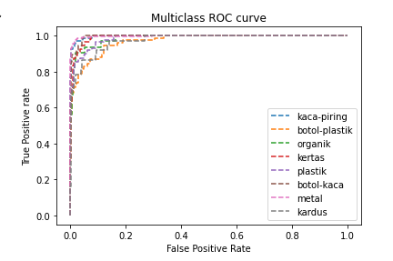
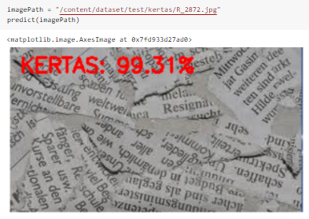

# myprojek
Sistem AI deteksi dilakukan dengan mengenal 8 jenis sampah dengan memproses gambar sebanyak 7,100 buah gambar. Hasil dari proses training dan test akan disimpan dalam format h5. Dengan menggunakan model VGG16 mendapatkan akurasi 90%.

## Hasil Evaluasi
Evaluasi ROC menunjukan setiap 8 kelas memiliki True Positive rate yang tinggi ini menunjukan bahwa model yang dibuat sudah dibuat dengan baik.

## Testing hasil
foto yang diberikan oleh user menunjukkan sampah kertas dengan tingkat persentase 99,31%.

